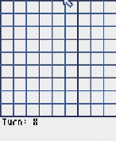

# 🎮 Ultimate Tic-Tac-Toe AI (AC-3 + MRV Heuristic)

This project is an AI-powered version of **Ultimate Tic-Tac-Toe** — a strategic expansion of the classic Tic-Tac-Toe game. It's built using Python and rendered with the **Pyxel** game engine.

The AI is designed using **Constraint Satisfaction Problem (CSP)** principles, enhanced with the **AC-3 algorithm** for consistency checking, and a **Minimum Remaining Values (MRV)** heuristic to make smart decisions.

---

## 🧠 How It Works

- **Game**: A 3x3 grid of Tic-Tac-Toe boards. Win the sub-board to win its spot on the main board.
- **AI Logic**:
  - Valid moves are generated using basic board constraints.
  - AC-3 removes inconsistent moves (illegal spots, full boards).
  - MRV Heuristic:
    1. First checks for an **immediate winning move** in the sub-board.
    2. If no win is possible, it chooses a move that sends the opponent to a **larger, more open sub-board**, maximizing future flexibility.

---

## 🎥 Preview Gameplay

Want a quick look before running the game?

▶️ [**WatchMe.mp4**](./WatchMe.mp4) – short screen recording of the AI playing against a human.




---

## 🖥️ Download and Play (No Python Needed)

A precompiled executable (`.exe`) is available for Windows users. No need to install Python!

### 🔽 Download:
[Download UltimateTicTacToe.exe](https://github.com/tauhaimran/ultiimate-TicTacToe/releases/download/v1.0.0-beta.1.0/ult_tictactoe.exe)

### ▶️ Run the Game:
1. Double-click `UltimateTicTacToe.exe`
2. Use your mouse to play as Player **X**
3. Watch the AI (Player **O**) play back using CSP logic

---

## 📁 Project Structure

```bash
UltimateTicTacToe/
│
├── Q3_latest.py         # Main game logic (Pyxel + AI)
├── preview.gif            # Demo gameplay recording
├── WatchMe.mp4          # Demo gameplay recording
├── UltimateTicTacToe.exe # Standalone executable (Windows)
├── README.md            # This file

